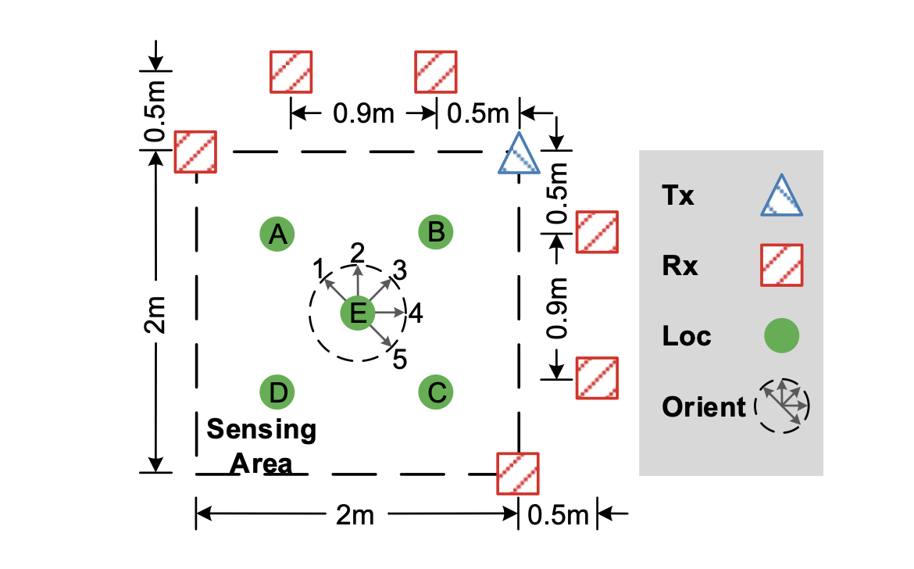
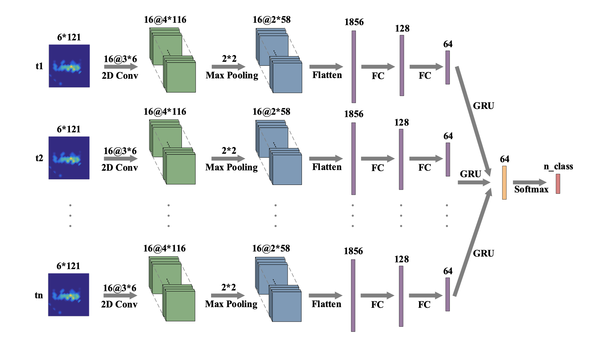
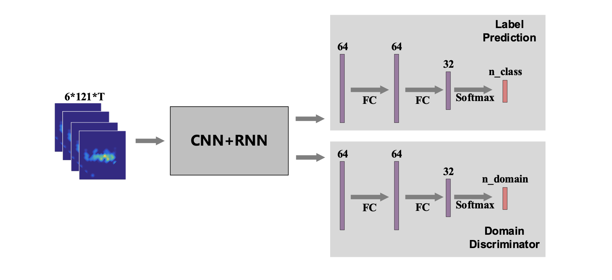
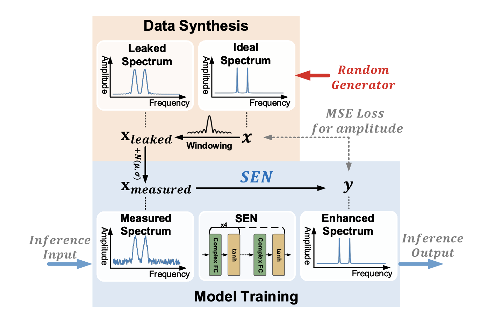

## Deep Learning Wifi Sensing Learning from scratch

**setup**

**RNN CNN**

**Adversarial Learning**

**SEN**

## References

https://github.com/Guoxuan-Chi/Wireless-Sensing-Tutorial

paper: https://arxiv.org/pdf/2206.09532